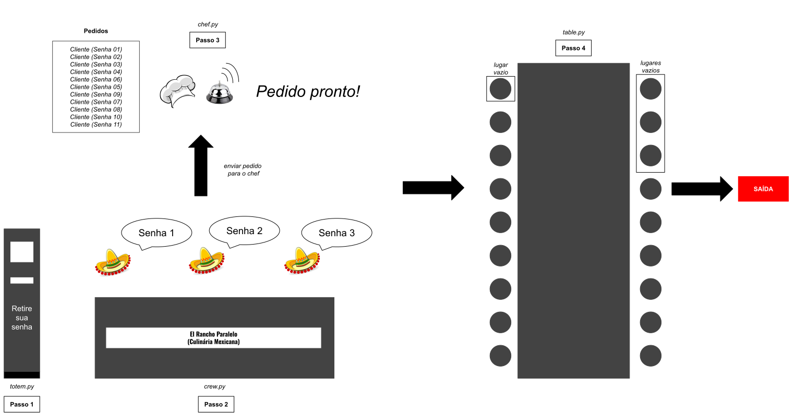

# El Rancho

O seu grupo foi contratado para desenvolver o fluxo de um restaurante de culinária mexicana chamado El Rancho. O programa é feito em Python e deverá utilizar estruturas de sincronização para coordenar a concorrência e acessos às regiões críticas.

**Requisitos**: Python 3.10 e Programação Orientada a Objetos (POO).

## Estrutura do código

```bash
    el-rancho/
    ├─ restaurant/
    │  ├─ chef.py
    │  ├─ client.py
    │  ├─ crew.py
    │  ├─ shared.py
    │  ├─ table.py
    │  ├─ totem.py
    ├─ main.py

```

## Funcionalidades

- **Totem.py**: O Totem é um dispositivo que emite as senhas de atendimento para pedidos no restaurante. As senhas são geradas aleatoriamente. A cada vez que um totem emite uma senha, ele avisa a equipe que uma senha foi retirada. E a equipe pode iniciar seu atendimento. 

- **Crew.py**: A equipe é formada por pessoas que atendem os clientes que chegam no restaurante. Um membro da equipe aguarda uma senha ser retirada do totem para poder atender um cliente. Ele atende prioritariamente a senha de menor valor. (exemplo: imagine que foram retiradas sequencialmente as seguintes senhas: 19,8,0,1,10. Os clientes serão atendidos na seguinte ordem: 0,1,8,10,19).


- **Client.py**: Ao chegar no restaurante, um cliente adquire uma senha que é gerada aleatoriamente. Ele aguarda ser chamado por um dos membros da equipe, pensa no que vai pedir por um determinado tempo, e depois faz o seu pedido. Após realizar o seu pedido, **o cliente aguarda primeiramente o chef fazer seu prato e aguarda um lugar na mesa ficar vazio**. Só assim ele poderá sentar na mesa, comer e ir embora.  


- **Chef.py**: O cozinheiro do restaurante é **único**, isso significa que não há outros cozinheiros no restaurante. Ele recebe pedidos da equipe do restaurante por uma fila e os prepara um por um.

- **Table.py**: O restaurante dispõe de apenas **uma mesa**, que é compartilhada entre os clientes. Os clientes "disputam" os assentos da mesa. **Uma regra de inicialização do programa é de que há mais clientes para serem atendidos que lugares disponíveis na mesa**. Lembre-se que o cliente só pode retirar o seu pedido quando houver um lugar vazio na mesa.

- **Shared.py**: Arquivo onde você deve armazenar suas variáveis compartilhadas entre as threads.

## Funcionamento do programa

*Observação: Esse fluxo leva em consideração a perspectiva de apenas um dos muitos cliente que irão usufruir dos serviços do restaurante El-Rancho.* 

Um **cliente A** (`client.py`) chega no restaurante, retira uma senha de atendimento (`totem.py`). Ele pode ter sorte de ter tirado a menor senha naquele instante, mas um **cliente B** que tenha chegado depois pode ter tirado uma senha de menor valor e ser atendido antes dele. 

Assim que o **cliente A** retira uma senha, o totem avisa a equipe (`crew.py`) que um cliente chegou. E um dos membros da equipe chama o **cliente A** quando for sua vez de ser atendido.

O **cliente A**, ao ser chamado pelo atendente, pensa por um certo período de tempo no que vai pedir (observe que não estamos preocupados com o que ele vai pedir, apenas com o tempo que ele vai levar para pedir). Assim que ele termina de pensar, o atendente coloca o pedido do **cliente A** na fila de pedidos que está sendo observada pelo cozinheiro do restaurante. 

O cozinheiro do restaurante (`chef.py`), depois de cozinhar outros pedidos, recebe o pedido do **cliente A** através de uma fila. Ele leva um tempo cozinhando o pedido e após finalizar o pedido do cliente, irá atender outros pedidos.

Com o prato do **cliente A** finalizado, é hora de esperar um lugar para comer. Ele aguarda um lugar da Grande Mesa (`table.py`) ficar vazio e disputa com outros clientes que tem seus pratos prontos e também estão aguardando. 

Assim que ele consegue um lugar, ele toma assento na Grande Mesa e consome o prato. Após consumir, ele vai embora.

Ilustramos o fluxo abaixo:



## Funcionamento do programa

Clone este repositório. Para executar a simulação, execute o seguinte comando no diretório principal:


```bash
python3 main.py --clients 10 --crew 2 --seats 5
```

Para imprimir ajuda:


```bash
python3 main.py --help
```

## Critérios de Avaliação

### [c1] - Execução concorrente de clientes (4/10)
- O esqueleto está fornecido em `client.py`;
- A lógica de funcionamento de um cliente **deve** ser implementada neste arquivo.
- Um cliente deve executar corretamente o seguinte fluxo:
    - Retirar uma senha;  
    - Deve esperar corretamente ser atendido;
    - Deve pensar no seu pedido e realizá-lo ao atendente da equipe;
    - Após pedir, deve esperar o prato ficar pronto;
    - Após um lugar na mesa ficar vazio, o cliente deve tomar um assento na Grande Mesa para comer;
    - O cliente deve finalizar corretamente após comer.
- Erros de sincronização e condições de corrida serão descontados.

### [c2] - Execução concorrente da equipe (3/10)
- O esqueleto está fornecido em `crew.py`.
- A lógica de funcionamento dos membros da equipe **deve** ser implementada neste arquivo.
- Um membro da equipe deve executar corretamente o seguinte fluxo:
    - Se estiver ocioso e houverem clientes que não foram atendidos, esperar o totem emitir um aviso de que uma senha foi retirada;
    - Chamar uma senha emitida e atender ao pedido do cliente;
    - Enviar o pedido do cliente ao cozinheiro através de uma fila;
    - Encerrar corretamente após todos os clientes serem atendidos;
- Erros de sincronização e condição de corrida serão descontados.

### [c3] -Execução concorrente do cozinheiro (3/10)
- O esqueleto está fornecido em `chef.py`
- A lógica de funcionamento do cozinheiro **deve** ser implementada neste arquivo.
- O cozinheiro deve executar corretamente o seguinte fluxo:
    - Deve aguardar chamados da equipe com pedidos de clientes;
    - Deve cozinhar todos os pedidos, retirados de uma fila;
    - Deve avisar que um pedido está pronto;
    - Depois que tiver cozinhado os pedidos de todos os clientes, deve encerrar sua execução;
- Erros de sincronização e condição de corrida serão descontados.

### Nota final

- Sendo *A* a nota de apresentação individual do aluno.
- Sendo *c1*, *c2* e *c3* os critérios de avaliação do código

A nota final será calculada da seguinte forma:

```bash
N = [A*(c1*0.4 + c2*0.3 + c3*0.3)]/10
```

**Atenção**: Como indicado pela fórmula mostrada acima, **a nota atribuída à solução adotada será ponderada pelo desempenho do aluno (individualmente) durante a apresentação do trabalho**. Por exemplo, se o professor atribuir a nota 10 para a solução adotada pelo grupo mas o aluno receber nota 5 pela apresentação - devido ao desconhecimento dos conteúdos teóricos, práticos e/ou da solução do trabalho - a sua nota final do trabalho será 5. A ausência no dia da apresentação ou recusa de realização da apresentação do trabalho implicará em nota zero na apresentação, fazendo com que a nota atribuída ao aluno também seja zero.

## Orientações Finais
1. É **obrigatório** o uso do código esqueleto fornecido. Não é permitido uso de PoolExecutor;
2. Não abusem de variáveis compartilhadas. Usem quando necessário, declarando **apenas** no arquivo `shared.py`. O seu código ficará mais organizado e com um maior encapsulamento;
3.  O código deverá ser **obrigatoriamente** bem comentado. Códigos mal comentados sofrerão deduções na nota final;
4.  **Explorem ao máximo a concorrência**. Quando mal utilizadas, estruturas de sincronização deixam de ser um remédio e se tornam um veneno para o desempenho final da aplicação. Usem essas estruturas com responsabilidade;
5. Há seções sinalizadas em que **não é possível a alteração do código**. Isso serve para que o código funcione corretamente para todos;
6. O uso de **espera ocupada** em qualquer parte do código receberá desconto;
7. Soluções baseadas em **supermutexes** (única sincronização global) serão descontadas;
8. Há prints padronizados espalhados em todo o código. O uso deles é **obrigatório**.

    
Bom trabalho!
